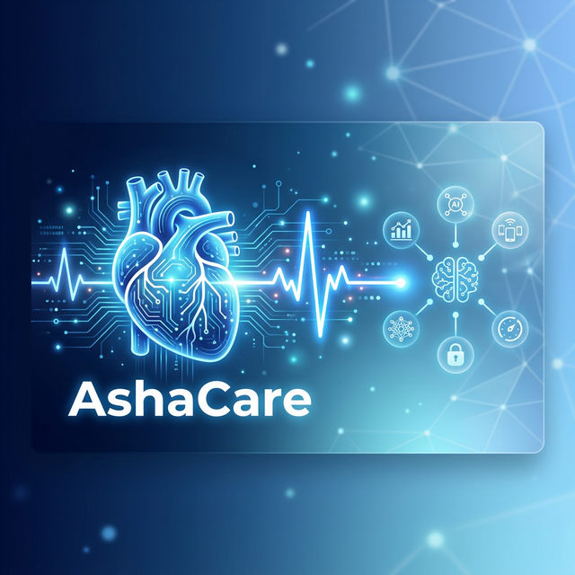

# <p align="center">AshaCare 🩺✨</p>

<p align="center">
  
</p>

<p align="center">
  <b>AshaCare</b> is a revolutionary AI-driven health risk predictor that analyzes user data to identify potential health issues, promoting early diagnosis and preventive care for <b>underserved communities</b>.
</p>

<p align="center">
  🔗 <b>Official Landing Page:</b> <a href="https://adjust-flaky-00482503.figma.site/">AshaCare Portfolio</a>
</p>

---

<p align="center">
  
  
  
  
  
  
</p>

## 🚀 Key Features

- 🏥 **Early Diagnosis & Preventive Care**: Specialized AI models designed to detect health risks early, specifically focused on improving healthcare outcomes for underserved populations.
- 🧬 **IoT BioSensor Integration**: Real-time synchronization with **ESP32-based hardware** over BLE & WiFi to track ECG, Heart Rate, and more.
- 🧘 **Hybrid Intelligence (RAG)**: Combines a localized medical/Ayurvedic knowledge base with **Llama 3.1** via Groq for high-accuracy health analysis.
- 🗣️ **Multilingual Accessibility**: Integrated with **Sarvam AI** for real-time translation and Text-to-Speech in regional Indic languages.
- 🎨 **Premium Glassmorphic UI**: A stunning, modern interface built with React Native Reanimated for smooth, high-fidelity interactions.
- 🔐 **Secure Auth**: Enterprisegrade authentication powered by **Clerk**.
- 🤖 **Predictive Modeling**: Dedicated Python AI service for disease prediction and health risk assessment.

---

## 🏗️ System Architecture

AshaCare is built on a modular, decentralized architecture:

1.  **AshaCare App (Mobile)**: The central dashboard built with Expo/React Native.
2.  **AshaLink Proxy (Node.js)**: Acts as the intelligent middleware, handling BLE/WiFi bridging and RAG (Retrieval Augmented Generation).
3.  **AshaBrain Microservice (Python)**: Handles complex predictive modeling using Scikit-Learn.
4.  **AshaSense (Hardware)**: ESP32-powered BioSensor modules collecting real-time physiological data.

---

## 🛠️ Technology Stack

| Component | Technology |
| :--- | :--- |
| **Mobile App** | React Native, Expo, Expo Router, Reanimated |
| **Backend Proxy** | Node.js, Express, Groq SDK |
| **AI Service** | Python, Flask, Scikit-learn, Jupyter |
| **Authentication** | Clerk Auth |
| **AI Models** | Llama 3.1 (via Groq), Sarvam AI (Indic TTS/Translate) |
| **Hardware** | ESP32, BLE, WiFi, Arduino Framework |
| **Design** | Lucide Icons, Expo Linear Gradient |

---

## 🚦 Getting Started

### 1. Repository Setup
```bash
git clone https://github.com/ananya-asa/Aetherion-26.git
cd AshaCare
```

### 2. Frontend Setup
```bash
cd main_app
npm install
npx expo start
```

### 3. Proxy Server (AshaLink)
```bash
cd main_app/server
npm install
# Create a .env with GROQ_API_KEY, SARVAM_API_KEY, and CLERK_SECRET_KEY
node proxy.js
```

### 4. AI Service (AshaBrain)
```bash
cd ai_model
pip install -r requirements.txt
python app.py
```

---

## 📄 License

This project is licensed under the MIT License - see the [LICENSE](LICENSE) file for details.

---

<p align="center">
  Made with ❤️ by the AshaCare SJEC Team
</p>
